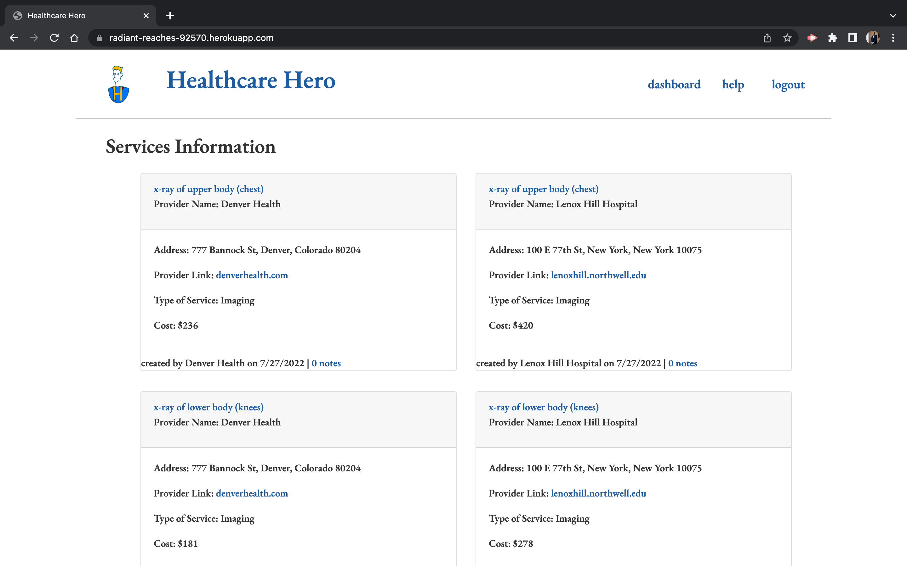

# Welcome to the HealthCare Hero App!

## Description
This app utilizes mainly backend technologies such as node.js, express, nodemailer, handlebars, MySQL and front-end technologies such as Javascript and Bootstrap CDN. HealthCare Hero is web application to help patients find medical services along with their cost and respective provider offering that service. Providers can post what services they offer and what they charge for those services; and can edit a service as necessary.

## Installation
After creating a repository called healthcare-hero on GitHub, index javascript files were created to start the project. Templates used from modules and previous homeworks were used to help build such files. Google Chrome was used to view/deploy the application locally and Heroku was also implemented to deploy the application globally.

## Usage
Pricing for medical services are usually hidden from the public. This app helps make the patient-provider relationship be more transparent. HealthCare used prospective patients searching for a medical service and cost associated with that service prior to making an appointment with a medical provider. It allows for patients to get a general understanding of how much a medical service will cost.

## Screenshots

## Link to HealthCare Hero
Heroku: https://powerful-island-90418.herokuapp.com/
 
Github: https://github.com/brudter/healthcare-hero

## Credits
[Daniel Lee](https://github.com/randiferous)
  [Samantha Haberman](https://github.com/Samantha-Ruth)
  [Stella Sun](https://github.com/Shuyu-Sun)
  [Travis Ramcharran](https://github.com/travisramcharran)
  [Yaakov Bockian](https://github.com/brudter)
